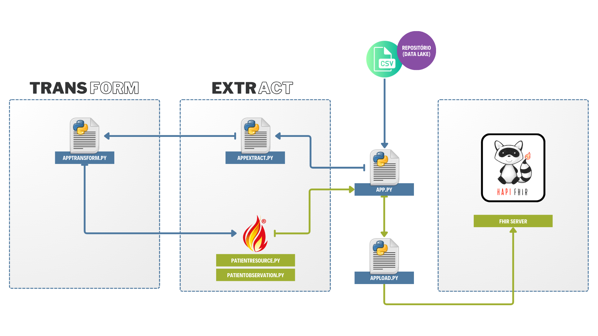
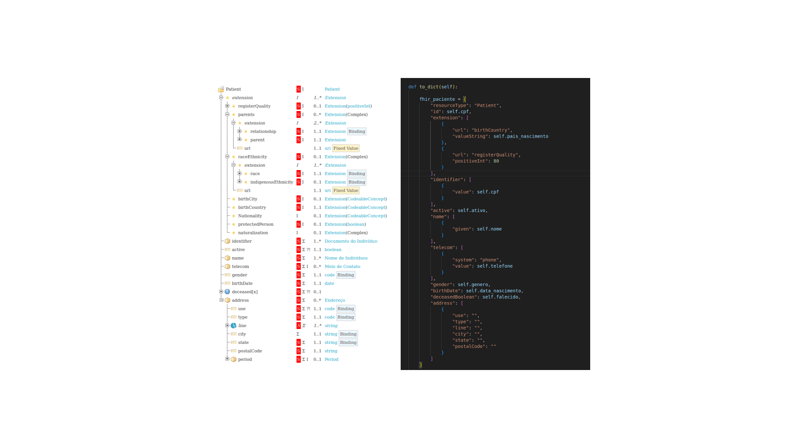

Aqui está o conteúdo formatado em Markdown:

# fhirserver
POC para criação de Servidor baseado em FHIR

## Configuração de Servidor FHIR (Arquitetura)

1. **Arquitetura construída sobre um servidor Linux em ambiente Windows utilizando Oracle VirtualBox**:
   - 8Gb de RAM, 50Gb de armazenamento e 2 CPU's, pela praticidade de ter um servidor Linux com distribuição Ubuntu LTS on-premises.
   - Faça o download do VirtualBox no link [VirtualBox Downloads](https://www.virtualbox.org/wiki/Downloads) e instale.

2. **Distribuição Linux Ubuntu 20.04.3 LTS**:
   - Por ser a distribuição mais difundida e ter uma comunidade ativa.
   - Também por se demonstrar uma versão estável para o projeto.
   - Optei por versão LTS (Long Term Support).
   - Efetuar download do ISO e disponibilizar em diretório para instalação na VM (Workspace/iso).

3. **Para criação de VM no Virtual Box com a imagem Linux**:
   - Siga o passo a passo para criação de VM no VirtualBox, configurando o diretório para instalação do SO para o diretório Workspace/iso_linux, além de configurar a VM no diretório Workspace/vm.

4. **Instalação do Docker no Ubuntu**:
   - Utilizando APT do Linux Ubuntu e o PIP Install do Python, incluindo docker-compose para salvar configurações do servidor.
   - Códigos utilizados:
     ```bash
     # Docker:
     sudo apt update
     sudo apt install -y apt-transport-https ca-certificates curl software-properties-common
     curl -fsSL https://download.docker.com/linux/ubuntu/gpg | sudo gpg --dearmor -o /usr/share/keyrings/docker-archive-keyring.gpg
     echo "deb [arch=amd64 signed-by=/usr/share/keyrings/docker-archive-keyring.gpg] https://download.docker.com/linux/ubuntu $(lsb_release -cs) stable" | sudo tee /etc/apt/sources.list.d/docker.list > /dev/null
     sudo apt update
     sudo apt install -y docker-ce docker-ce-cli containerd.io
     sudo systemctl enable --now docker

     # Docker Compose:
     pip install docker-compose
     docker-compose --version
     ```

5. **Gerado Docker Compose baseado em imagens disponíveis no Docker Hub**:
   - Utilizando HAPI FHIR para criação de servidor FHIR baseado nas seguintes Tecnologias:
     - Java, Spring Boot (RestFull), Hibernate, PostgreSQL, Tomcat (Server), JSON / XML, Swagger (Documentação).
   - Podemos destacar que a HAPI FHIR implementa em 100% o padrão FHIR.
   - Para mais informações da implementação, acesse: [Link da Imagem e documentação HAPI FHIR implementado com PostgreSQL](https://hub.docker.com/r/hapiproject/hapi)

6. **Sobre o Docker Compose gerado**:
   - O arquivo foi criado baseado nas especificações do Docker Compose .yaml 3.8, executado sobre engine docker compose 1.29 com implementação extra de segurança para não expor dados sensíveis de acesso ao banco de dados, adotando outra abordagem, que seria configuração dessas informações diretamente no ambiente de variáveis do sistema operacional.
   - Para isso, foi criado o arquivo .env que armazena essas informações.

7. **Docker Compose do FHIRServer possui volumes para armazenamento das persistências PostgreSQL on-premises**:
   - Necessário executar o arquivo "volumes" se for manter os dados do contêiner localmente.
  
8. **O ETL foi construído em estrutura Python, com camada Extract, Transform e Load separadas e modularizadas:**
   - Criadas classes que implementam os dois objetos enviados para o servidor FHIR: PatientResource e PatientObservation;
   - Criado arquivo orquestrador do Pipeline de carga, chamado app.py, que efetua a carga nos Endpoints do Servidor FHIR.
   
   
   
9. **A Classe PatientResource.py implementa as especificações do profile Resource Patient para as necessidades nacionais:**
   - A fonte de dados não possui todos os campos que estão propostos no Profile, sendo assim, a classe PatientResource foi adaptada para conter os campos da fonte de dados, em seus respectivos mapeamentos do profile;
   - Para fins de teste, foram mantidos alguns campos nulos do profile proposto, apenas para averiguar como a API se comportaria ao inserir um paciente incompleto.
   
   
   
